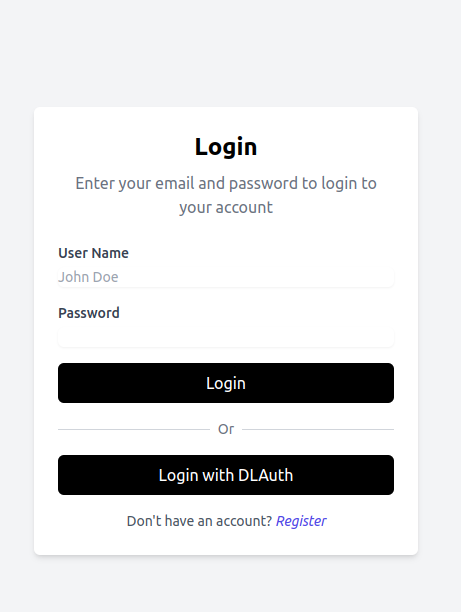
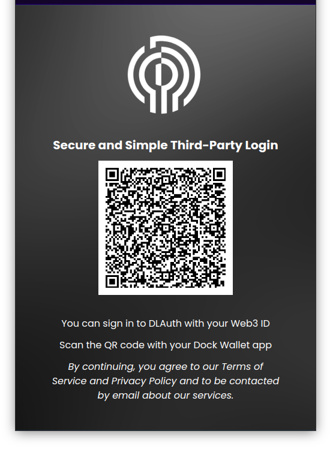
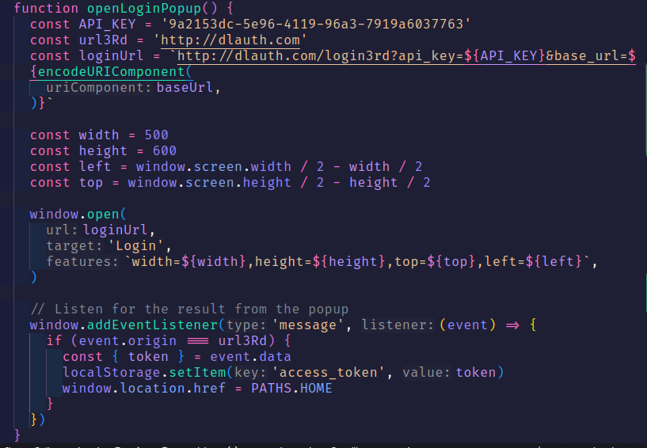

## Quy trình tích hợp login vào website của bạn bằng dịch vụ của DLAUTH

**Ghi chú: Để có thể tích hợp login vào website của bạn bằng dịch vụ của DLAUTH bạn cần đăng kí website của mình với owner của DLAUTH.**

### 1. Tích hợp vào website của bạn

- Tại giao diện đăng nhập của bạn hãy tạo thêm 1 nút đăng nhập bằng DLAUTH. Khi người dùng click vào nút này thì bạn sẽ chuyển hướng người dùng đến trang đăng nhập của DLAUTH(Như hình)
  
  
- Đối với việc tích hợp chúng tôi sau khi đăng kí thành công website của bạn vào hệ thống sẽ cũng cung cấp cho bạn 1 key

  Example:

  ```javascript
  const API_KEY = '9a2153dc-5e96-4119-96a3-7919a6037763'
  ```

- Khi người dùng click vào nút đăng nhập bằng DLAUTH bạn cần chuyển hướng người dùng đến trang đăng nhập của DLAUTH của owner bạn đã đăng ký với tham số API_KEY
  **Lưu ý:** Chúng tôi khuyến khích bạn tạo nó theo dạng popup để người dùng không cần phải rời khỏi trang hiện tại

  Example:

  ```javascript
  const url = `https://dlauth.com/login3rd?api_key=${API_KEY}&base_url=${window.location.href}`
  ```

Trong đó `base_url` là url của trang hiện tại mà người dùng đang ở ví dụ như `https://yourwebsite.com`

- Đồng thời bạn cũng nên tạo một sự kiện lắng nghe bởi window để có thể nhận được token sau khi nguời dùng đăng nhập thành công

  ```javascript
  Example: window.addEventListener('message', function (event) {
    if (event.origin !== 'https://dlauth.com') return
    const { token } = event.data
    // Do something with token
  })
  ```

### 2. Sử dụng token để xác thực người dùng

- Đối với việc xác thực chúng tôi cũng cung cập cho bạn 1 API để xác thực token

  ```javascript
  Endpoint: https://dlauth.com/api/auth/verify-account
  ```

  Example:

  ```javascript
  fetch('https://dlauth.com/api/auth/verify-account', {
    method: 'GET',
    headers: {
      Authorization: `Bearer ${token}`,
    },
  })
  ```

- Nếu token hợp lệ thì server sẽ trả về thông tin về người dùng kết quả là true còn không sẽ trả lỗi tương ứng

### 3. Lưu ý

- Token chỉ có hiệu lực trong 1 giờ
- Token chỉ có thể sử dụng 1 lần
- Token chỉ có thể sử dụng trên domain đã đăng ký với owner
- Bạn phải đăng kí thêm 1 tài khoản trên app dlauth để có thể quét mã QR

### 4. Kết luận

- Với quy trình trên bạn đã có thể tích hợp login vào website của bạn bằng dịch vụ của DLAUTH

- Nếu bạn cần hỗ trợ hoặc có bất kỳ thắc mắc nào vui lòng liên hệ với chúng tôi qua email: longnguyendev2020@gmail.com

### 5. Ví dụ tổng quát tham khảo


